---

title: "DV_FinalProject"
author: "Madeline Packard and Arthur DeVitalis"
date: "May 13, 2015"
output:
  html_document:
    theme: cerulean
    highlight: tango
---
For our final project, we wanted to explore data provided by the government of Canada through their Open Data portal. We choose this source for its credibility, accessibility, and variety of comparative datasets.


##The Data: College Graduates Survey

As college students ourselves, we were interested in looking into Canadian college graduate data. We're familiar with US graduation and employment rates, so we tried a neighboring country.

```{r, include=FALSE, results = "hide"}
source("../01 Data/packages.R", echo = FALSE)
```

```{r, message=FALSE}
source("../02 Data Wrangling/Dataframes.R", echo = FALSE)
```

We pulled four datasets from a national survey of graduates data, which span over 2000, 2005, and 2010. The date is

####Grad Earnings, by Gender and Median Earning

```{r, eval=FALSE}
grad_earnings <- data.frame(fromJSON(getURL(URLencode(gsub("\n", " ", '129.152.144.84:5001/rest/native/?query= "select REF_DATE, GEO, SCHOOL, GENDER, STATS, VALUE from GRAD_EARNINGS "')),httpheader=c(DB='jdbc:oracle:thin:@129.152.144.84:1521:ORCL', USER='C##cs329e_map4542', PASS='orcl_map4542', MODE='native_mode', MODEL='model', returnDimensions = 'False', returnFor = 'JSON'), verbose = TRUE)))
```

```{r, message=FALSE, echo = FALSE}
tbl_df(grad_earnings)
```

Using data wrangling, we can compare the average salary for doctorate graduates with the average salary for college graduates, by gender.


#####Average Doctorate Earnings

For our graduate earnings data, we looked at the pay gap between men and women's average salary, at different schooling levels.

```{r, eval = FALSE}
doctorate_earnings <- grad_earnings %>% filter(SCHOOL %in% c("Doctorate"), STATS == "Median", GENDER != "Both sexes", VALUE != "null")
```

```{r, message=FALSE, echo = FALSE}
tbl_df(doctorate_earnings)
```

From this data, we created a visualization of average salary of doctorate graduates, by gender.

```{r, eval = FALSE}
doctorate_earnings %>% ggplot(aes(x=GEO, y=VALUE, color=GENDER)) + geom_point() + ggtitle('Average Doctorate Graduate Earnings') + scale_color_brewer(palette="Set1") + facet_wrap(~REF_DATE) + theme(axis.text.x=element_text(angle=90, size=10, vjust=0.4), plot.title = element_text(size=20, face="bold", vjust=2), axis.title.x = element_blank())
```
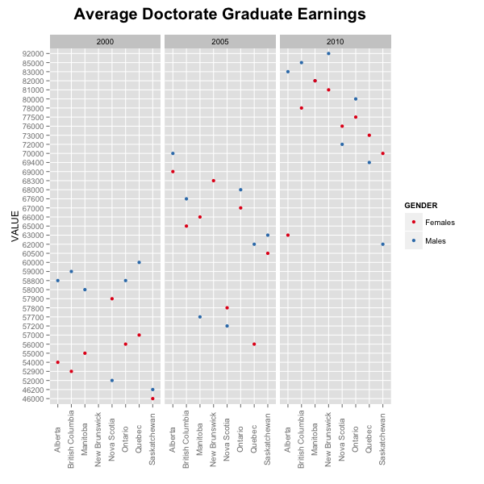  

#####Average College Earnings

```{r, eval = FALSE}
college_earnings <- grad_earnings %>% filter(SCHOOL %in% c("College"), STATS == "Median", GENDER != "Both sexes", VALUE != "null")
```
```{r, message=FALSE, echo = FALSE}
tbl_df(college_earnings)
```

Here, we did a similiar wrangle to the average salary of college graduates, by gender.

```{r, eval = FALSE}
college_earnings %>% ggplot(aes(x=GEO, y=VALUE, color=GENDER)) + geom_point() + ggtitle('Average College Graduate Earnings') + scale_color_brewer(palette="Set1") + facet_wrap(~REF_DATE) + theme(axis.text.x=element_text(angle=90, size=10, vjust=0.4), plot.title = element_text(size=20, face="bold", vjust=2), axis.title.x = element_blank())
```

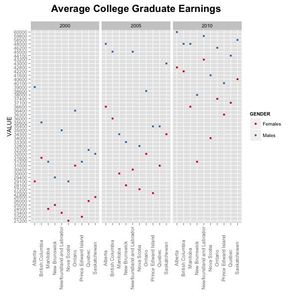  


####Grad Debt, by Averages and Percentages of Grads who have Paid Off 

```{r, eval=FALSE}
grad_debt <- data.frame(fromJSON(getURL(URLencode(gsub("\n", " ", '129.152.144.84:5001/rest/native/?query= "select REF_DATE, GEO, SCHOOL, SOURCE, STATS, VALUE from GRAD_DEBT "')),httpheader=c(DB='jdbc:oracle:thin:@129.152.144.84:1521:ORCL', USER='C##cs329e_map4542', PASS='orcl_map4542', MODE='native_mode', MODEL='model', returnDimensions = 'False', returnFor = 'JSON'), verbose = TRUE)))
```
```{r, message=FALSE, echo = FALSE}
tbl_df(grad_debt)
```

From this data, we wanted to create a visualization for the average debt owed for students to government loan programs, for the year 2010.

```{r, eval = FALSE}
debt2010 <- grad_debt %>% filter(REF_DATE == 2010, SOURCE == "Graduates who owed money for their education to government student loan programs", STATS == "Average debt owed to the source at time of graduation dollars", VALUE != "null") %>% ggplot(aes(x=GEO, y=VALUE, color=SCHOOL)) + geom_point() + ggtitle('Average Debt Owed\n to Government Loans in 2010') + scale_color_brewer(palette="Set1") + theme(axis.text.x=element_text(angle=90, size=10, vjust=0.4), axis.title.y = element_blank(), axis.title.x = element_blank(), legend.title=element_blank(), plot.title = element_text(size=20, face="bold", vjust=2, lineheight=0.8))
```

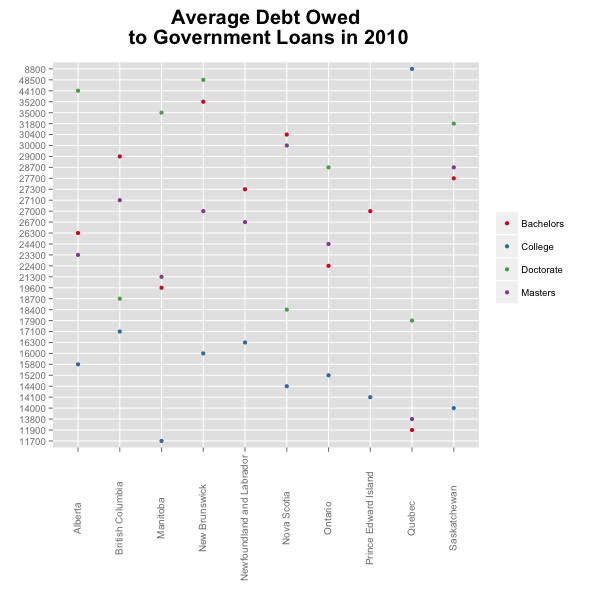  

####Grad Employment, by Rates and Percentages

```{r, eval=FALSE}
grad_employment <- data.frame(fromJSON(getURL(URLencode(gsub("\n", " ", '129.152.144.84:5001/rest/native/?query= "select REF_DATE, GEO, SCHOOL, GENDER, STATS, VALUE from GRAD_EMPLOYMENT "')),httpheader=c(DB='jdbc:oracle:thin:@129.152.144.84:1521:ORCL', USER='C##cs329e_map4542', PASS='orcl_map4542', MODE='native_mode', MODEL='model', returnDimensions = 'False', returnFor = 'JSON'), verbose = TRUE)))
```

```{r, message=FALSE, echo = FALSE}
tbl_df(grad_employment)
```

We were intersted in the unemployment and emploment rates for both sexes, at the highest and lowest school levels.

#####Average College Employment Rates

```{r, eval=FALSE}
college_employment_rates <- grad_employment %>% filter(SCHOOL %in% c("College"), STATS %in%  c("Unemployed rate", "Employed percent"), GENDER != "Both sexes", VALUE != "null") %>% arrange(desc(VALUE))
```

```{r, message=FALSE, echo = FALSE}
tbl_df(college_employment_rates)
```

We created a bar chart that looks at the employment rates across Canada for each year.

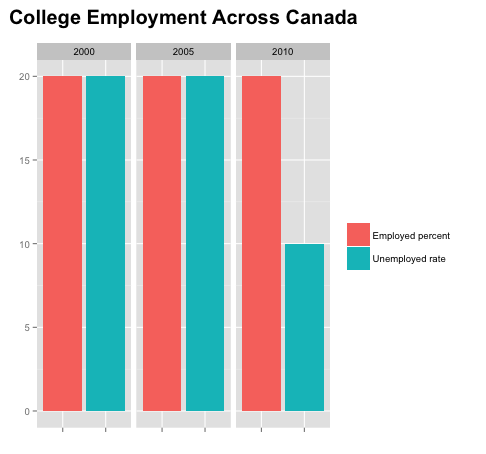  

#####Average Doctorate Employment Rates
```{r, eval=FALSE}
doctorate_employment_rates <- grad_employment %>% filter(SCHOOL %in% c("Doctorate"), STATS %in%  c("Unemployed rate", "Employed percent"), GENDER != "Both sexes", VALUE != "null") %>% arrange(desc(VALUE)) %>% tbl_df
```

```{r, message=FALSE, echo = FALSE}
tbl_df(doctorate_employment_rates)
```

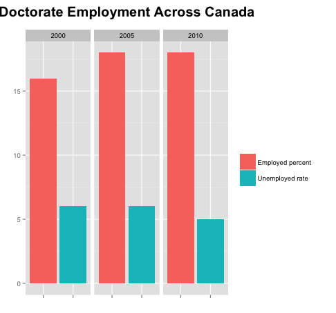  

##Tableau

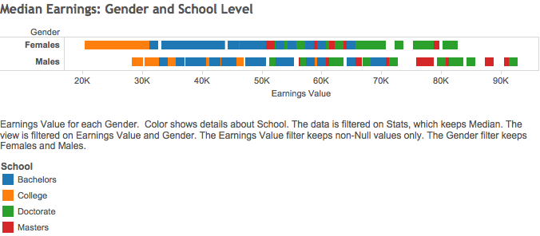  


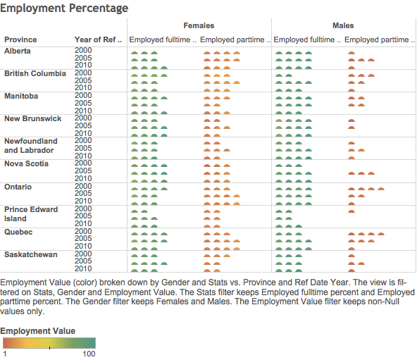 


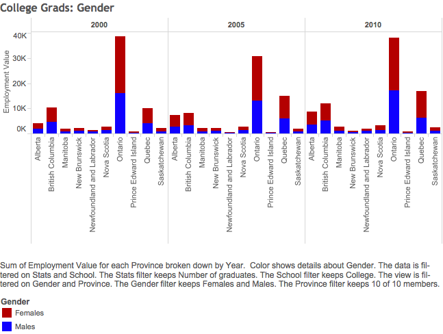  

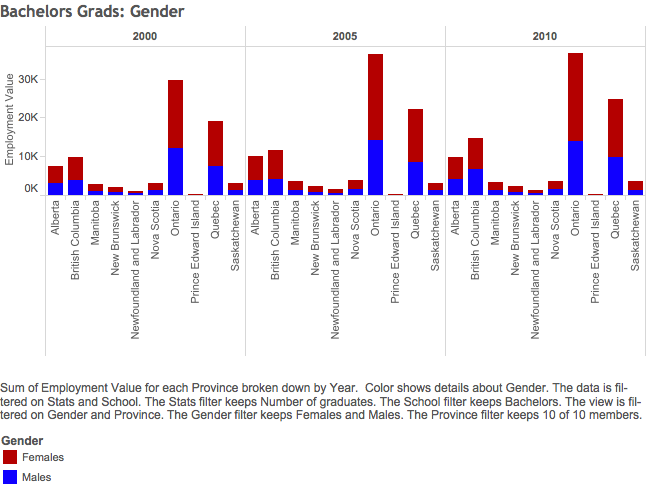  

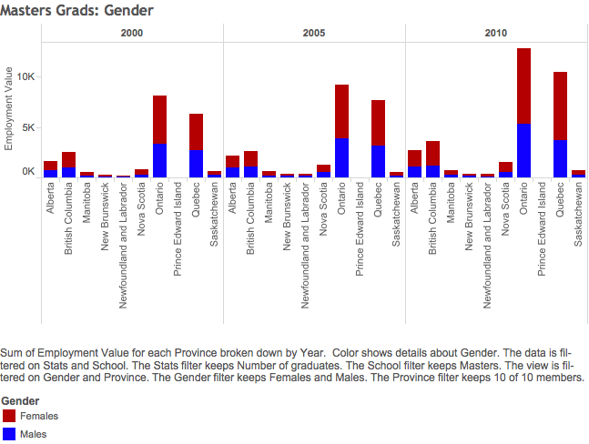  

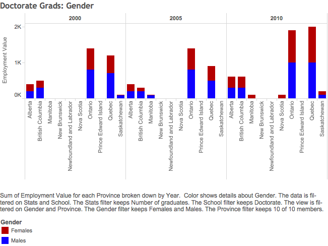  


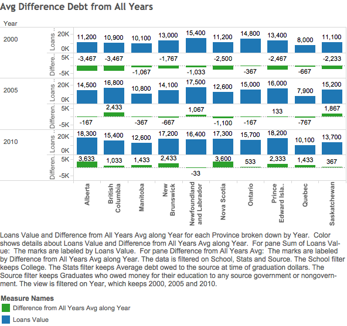  


  
